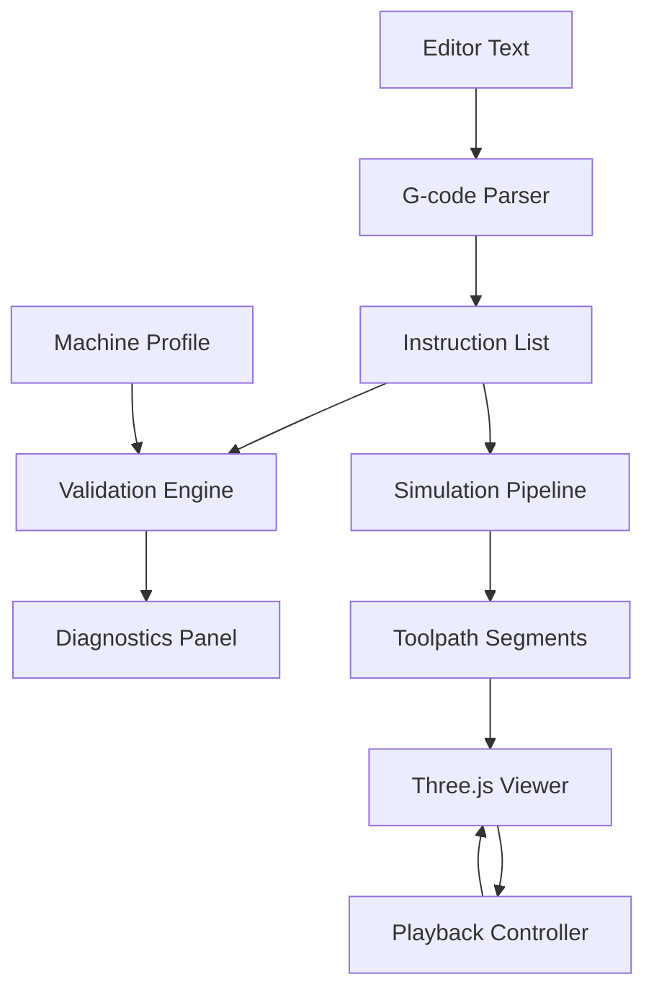

# WebGCode 2 | Engineering Documentation

WebGCode 2 is a high-performance, deterministic, and local-only G-code editor, validator, and 3D simulation tool. Designed for CNC machinists and software engineers, it prioritizes absolute state consistency and precise toolpath visualization over traditional web aesthetics.

## 1. Product Philosophy: The "Instrument UI"

WebGCode 2 is built as an **Instrument**, not just an application.
- **Deterministic**: Every simulation step is discrete and reproducible. Playback is immune to frame-rate fluctuations or CPU load.
- **Local-Only**: Data residency is strictly on-client. No backend, no telemetry, no cloud persistence.
- **State-Driven**: The entire application is a pure projection of the `editorText` and `machineProfile` state stored in Zustand.

## 2. System Architecture

The application follows a unidirectional data flow model where the editor content serves as the Single Source of Truth.



### 2.1 G-code Parser & Tokenizer
A robust, non-mutating parser that converts raw G-code into structured objects.
- **Tokenizer**: Line-by-line scanning with comment handling (`;` and `()`).
- **Classification**: Distinguishes between Motion commands (G), Miscellaneous commands (M), and Parameters (X, Y, Z, F, S, etc.).

### 2.2 Validation Engine
Real-time rule-based validation against the active Machine Profile.
- **Axis Limits**: Checks if any command exceeds X, Y, or Z travel limits.
- **Command Support**: Identifies unsupported or deprecated G/M codes.
- **Parameter Integrity**: Ensures mandatory parameters (like feed rates) are present where required.

### 2.3 Simulation & Playback
The simulator computes precise tool movements between coordinates.
- **Motion Types**: Support for Rapid Positioning (G0), Linear Interpolation (G1), and Arc Interpolation (G2/G3).
- **Step-Based Progress**: Advancement is calculated using `currentStepIndex` (integer) and `preciseProgress` (float), ensuring 100% deterministic scrubbing and play/pause behavior.

## 3. Technical Specifications

| Category      | Technology | Rationale |
| :---          | :---       | :--- |
| **Framework** | Next.js 15 (App Router) | Modern react patterns, optimized routing. |
| **State**     | Zustand | Low-latency, atomic state updates. |
| **Editor**    | Monaco Editor | Industrial-grade code editing and marker support. |
| **Rendering** | Three.js (R3F) | High-performance WebGL toolpath visualization. |
| **Styling**   | Tailwind CSS v4 | Strict adherence to engineering design tokens. |
| **Export**    | gifshot | Deterministic frame-capture for documentation. |

## 4. Engineering Standards

### 4.1 Design Tokens (Locked)
The UI uses a strict color and typography palette to maintain an "Instrument" look:
- **Surface**: `#0F1216` (Deep BG), `#1A1F26` (Panel BG)
- **Primary**: `#3B82F6` (Motion Blue)
- **Secondary**: `#10B981` (Safe Green)
- **High Alert**: `#EF4444` (Error Red)
- **Fonts**: Inter (UI), JetBrains Mono (Code)

### 4.2 Workspace Configuration
- **Root Context**: The project is isolated to ensure Next.js Turbopack correctly identifies the root directory.
- **File Watching**: Configured to handle standard OS `inotify` limits for large engineering projects.

## 5. Development

### Prerequisites
- Node.js 18+
- npm 9+

### Execution
```bash
# Install dependencies
npm install

# Start development server
npm run dev

# Production build & verification
npm run build
```

## 6. File I/O Specifications
- **Supported Extensions**: `.gcode`, `.gc`, `.ngc`, `.cnc`, `.txt`
- **Import**: File picker or global Drag-and-Drop listener.
- **Export**: GIF (Simulation Export), `.gcode` (Source Export).

---
© 2026 WebGCode Engineering Team. Confidential & Local-Only.
